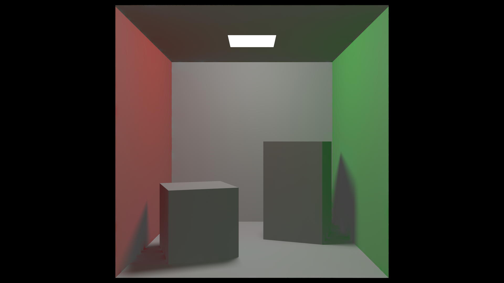
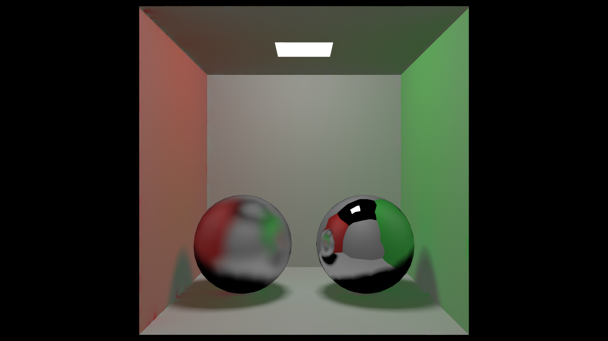
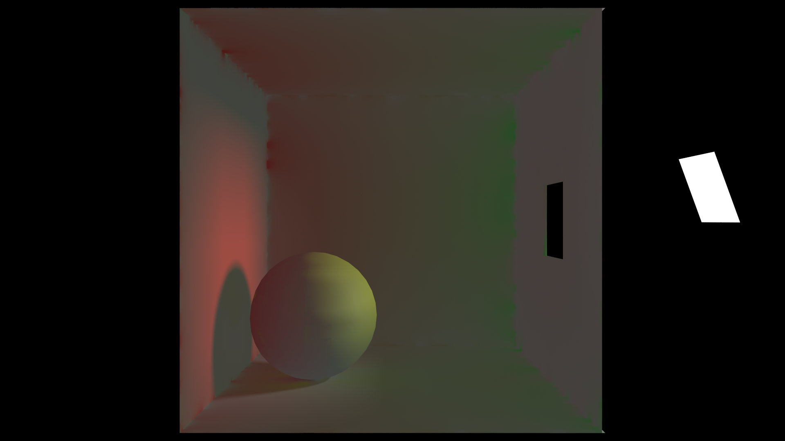
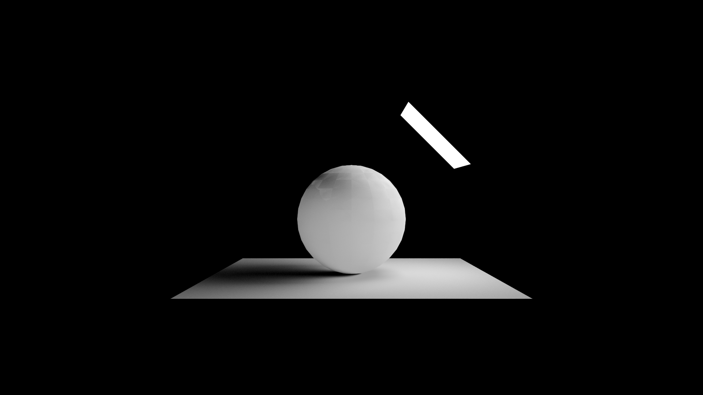
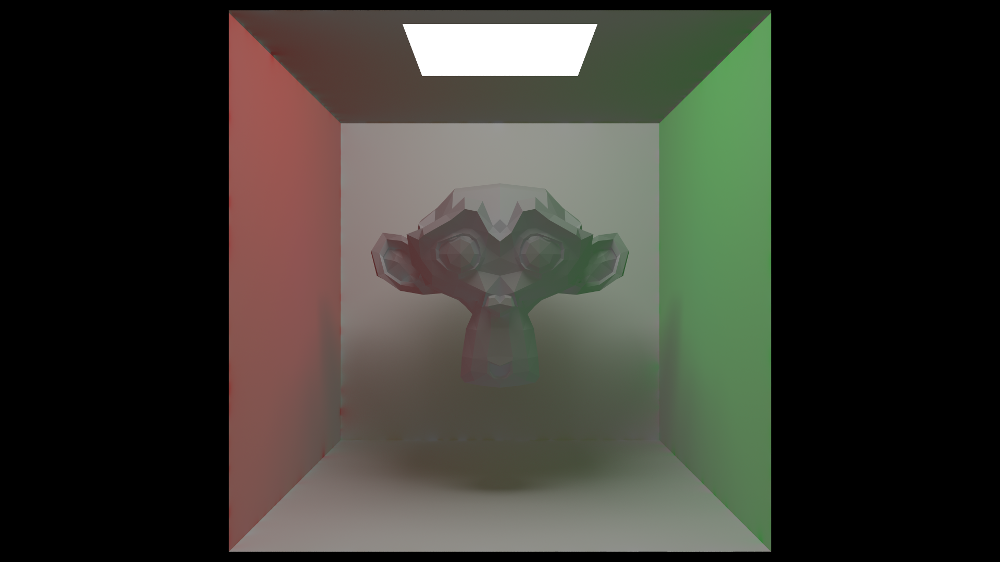

## Binaires
Les binaires sont disponibles dans l'onglet release. Seuls les binaires windows (32 et 64 bits) sont disponibles.

* [Couscous Raytracer 1.0](https://github.com/Yt-trium/Couscous-raytracer/releases)

## Builds
### Dépendances
Le projet dépend de la bibliothèque Qt. Le projet est compatible avec Qt4 et Qt5.
Aucune autre dépendance n'a besoin d'être installé.

### Production
Pour compiler le projet, vous pouvez utiliser le fichier CMakeLists.txt (CMake) ou Couscous-raytracer.pro (QtCreator).

## Démonstration Vidéo

## Quelques rendus

Cornell Box

Cornell Box Metal

Cornell Box Window

Sphere

Suzanne

## Lancer de rayons stochastique

> **Cliquez sur **:book:** pour accéder au code source associé à la fonctionnalitée.**

[:book:](https://github.com/Yt-trium/Couscous-raytracer/blob/master/src/renderer/visualobject.cpp#L131) Utilisation de l'algorithme [Möller–Trumbore](https://en.wikipedia.org/wiki/M%C3%B6ller%E2%80%93Trumbore_intersection_algorithm) pour le test d'intersection rayon-triangle. Permet de facilement interpoler les normales pour faire du **Smooth Shading**. 

[:book:](https://github.com/Yt-trium/Couscous-raytracer/blob/master/src/renderer/visualobject.cpp#L61) Les normales non interpolées sont calculées et stockées avant le rendu.

[:book:](https://github.com/Yt-trium/Couscous-raytracer/blob/master/src/renderer/visualobject.cpp#L38) Les sources de lumières sont des maillages qui ont un matériel avec une émission.

[:book:](https://github.com/Yt-trium/Couscous-raytracer/blob/master/src/renderer/render.cpp#L420) Utilisation du modèle Phong pour l'éclairage direct.

[:book:](https://github.com/Yt-trium/Couscous-raytracer/blob/master/src/renderer/gridaccelerator.cpp#L136) Accélération des tests d'intersection avec une grille de voxels. Parcours de la grille par *Digital Differential Analyser*.

[:book:](https://github.com/Yt-trium/Couscous-raytracer/blob/master/src/renderer/samplegenerator.cpp#L23) *Anti-Aliasing* par *Jittered sampling*.

[:book:](https://github.com/Yt-trium/Couscous-raytracer/blob/master/src/renderer/render.cpp#L403) Réflexions avec coefficient de lissage réglable.

[:book:](https://github.com/Yt-trium/Couscous-raytracer/blob/master/src/renderer/photonMapping.cpp#L127) Lancement de photons et *scattering*.

[:book:](https://github.com/Yt-trium/Couscous-raytracer/blob/master/src/renderer/photonMapping.cpp#L222) Stockage des photons dans un kd-tree. Utilisation de [*nanoflann*](https://github.com/jlblancoc/nanoflann).

[:book:](https://github.com/Yt-trium/Couscous-raytracer/blob/master/src/renderer/render.cpp#L470) Utilisation des photons pour l'éclairage indirect.

## Fonctionnalités supplémentaires

- Rendu de différents buffers (*Normals*, *Direct Diffuse*, *Dirrect Specular*, *Photon Map*, ...) disponible dans *Debug > View*
- Personalisation de la scène depuis la GUI
	- Modification et ajout de matériaux
	- Modification et ajout de primitves
	- Modification et ajout d'instances de fichiers *.OFF*
	- Modification de la caméra et des paramètres de rendu
- Plusieurs scènes disponibles par défaut dans *Presets*

## Références

- [Ray Tracing in One Weekend by Peter Shirley](https://github.com/petershirley/raytracinginoneweekend)
- [Ray Tracing The Next Week by Peter Shirley](https://github.com/petershirley/raytracingthenextweek)
- [Physically Based Rendering: From Theory To Implementation](https://github.com/mmp/pbrt-v3/)
- [Photon Mapping by Zack Waters ](https://web.cs.wpi.edu/~emmanuel/courses/cs563/write_ups/zackw/photon_mapping/PhotonMapping.html)
- [The Phong Model, Introduction to the Concepts of Shader, Reflection Models and BRDF](https://www.scratchapixel.com/lessons/3d-basic-rendering/phong-shader-BRDF)
